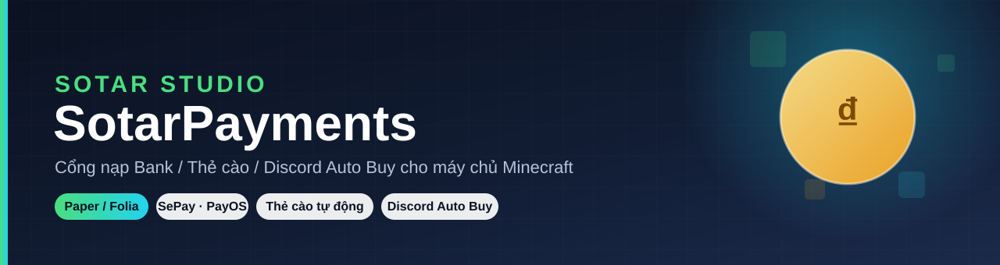

<div align="center">



<h3>Cổng nạp Bank • Thẻ cào • Discord Auto Buy cho máy chủ Minecraft</h3>

[](../../actions/workflows/build.yml)
[](../../releases)
[](#-bản-quyền)
[](#-yêu-cầu-hệ-thống)
[](#-yêu-cầu-hệ-thống)
[](https://discord.gg/jD5naBEGMA)

**[📖 Tài liệu](docs/) · [⚙️ Cài đặt](docs/installation.md) · [💬 Lệnh & quyền](docs/commands.md) · [🛠️ Cấu hình](docs/configuration.md) · [🛍️ Discord Auto Buy](docs/discord-store.md) · [❓ FAQ](docs/faq.md)**

</div>

---


## 📌 Giới thiệu

**SotarPayments** là plugin nạp tiền toàn diện cho máy chủ Minecraft (Paper/Folia), hỗ trợ **nạp qua chuyển khoản ngân hàng (VietQR)**, **nạp thẻ cào tự động** qua nhiều nhà cung cấp, **cửa hàng Discord Auto Buy** bán vật phẩm ngay trên Discord, cùng hệ thống **mốc nạp, bảng xếp hạng, lịch sử giao dịch và webhook thông báo** — tất cả trong một plugin duy nhất, cấu hình hoàn toàn bằng file YAML, không cần can thiệp code.

Đây là bản fork/phát triển tiếp từ [KoraPayments](https://github.com/dduong19208/KoraPayments). Tài liệu bên dưới được viết lại theo tên plugin, package, lệnh và cấu hình đang có trong SotarPayments; không dùng lẫn các lệnh `kora-*` của repo gốc.

## ✨ Tính năng nổi bật

| | |
|---|---|
| 🏦 **Nạp ngân hàng (VietQR)** | Sinh mã QR chuyển khoản tự động, đối soát giao dịch qua SePay hoặc PayOS, cộng tiền tức thì. |
| 💳 **Nạp thẻ cào** | Hỗ trợ Card2K, GachTheFast, Thesieure — có tính thuế theo mệnh giá, che số thẻ/seri nhạy cảm khi xác nhận. |
| 🛍️ **Discord Auto Buy** | Bot Discord riêng bán vật phẩm bằng embed + nút bấm, log đơn hàng, feedback, audit log theo từng kênh. |
| 🔔 **Webhook giao dịch** | Gửi thông báo nạp bank/thẻ/thủ công về Discord theo thời gian thực, màu sắc tùy chỉnh từng loại giao dịch. |
| 🏆 **Mốc nạp & bảng xếp hạng** | Quà mốc nạp cá nhân, mốc nạp toàn server (kèm boss bar), top nạp theo tuần/tháng/toàn thời gian. |
| 🖥️ **Giao diện hiện đại** | Tự dùng Dialog UI trên Paper/Leaf mới, tự quay về GUI kho đồ + chat trên các bản cũ hơn. |
| 💰 **Đa nền kinh tế** | Tương thích Vault, PlayerPoints, FancyEconomy hoặc lệnh console tùy chỉnh — tự động chọn theo thứ tự ưu tiên. |
| 🗄️ **Đa cơ sở dữ liệu** | SQLite (mặc định, không cần cấu hình), MySQL, MariaDB, PostgreSQL — có sẵn connection pool HikariCP. |
| 🌐 **Đa ngôn ngữ** | 18 ngôn ngữ sẵn có (vi, en, zh, ja, ko, th, id, ms, tl, ru, tr, ar, hi, fr, de, es, pt, pl). |
| 🧩 **PlaceholderAPI** | Expansion `%kp_*%` hiển thị tổng nạp, hạng, mốc gần nhất... ở bảng xếp hạng, tab list, bossbar. |
| 🧵 **Folia sẵn sàng** | Dùng scheduler riêng theo từng region, chạy ổn định trên cả Paper truyền thống lẫn Folia. |
| 📊 **bStats** | Thống kê ẩn danh giúp theo dõi sức khỏe plugin, có thể tắt trong `config.yml`. |

## 🚀 Bắt đầu nhanh

```bash
# 1. Tải plugin (.jar) từ Releases hoặc tự build
mvn clean package

# 2. Bỏ file .jar vào thư mục plugins/ của máy chủ Paper/Folia
cp target/SotarPayments-1.4.3.jar /path/to/server/plugins/

# 3. Khởi động máy chủ để plugin sinh file cấu hình mặc định
#    (config.yml, database.yml, payments.yml, providers/*.yml, ...)

# 4. Điền API key nhà cung cấp trong plugins/SotarPayments/providers/
#    rồi tải lại
/sotar-admin reload
```

📖 Hướng dẫn chi tiết từng bước: [docs/installation.md](docs/installation.md)

## 🧭 Lệnh chính

| Lệnh | Chức năng |
|---|---|
| `/bank [số tiền\|gui\|cancel]` | Nạp tiền qua ngân hàng (VietQR) |
| `/napthe [gui\|loại thẻ mệnh giá [seri] [mã thẻ]]` | Nạp thẻ cào |
| `/confirmcard`, `/cancelcard` | Xác nhận / hủy giao dịch nạp thẻ |
| `/topnap [all\|week\|month] [trang]` | Bảng xếp hạng nạp |
| `/lichsunap` | Lịch sử nạp cá nhân |
| `/mocnap <canhan\|server\|bossbar>` | Quà mốc nạp |
| `/sotar-admin` (`/kp-admin`) | Bảng điều khiển quản trị: `gui`, `reload`, `status`, `napthucong`, `lichsunap`, `mocnap`, `reset`, `migrate-database` |
| `/taokenhbanhang [publish\|reload\|status]` | Gửi/quản lý embed cửa hàng Discord Auto Buy |

Danh sách quyền đầy đủ: [docs/commands.md](docs/commands.md)

## ⚙️ Yêu cầu hệ thống

- **Server:** Paper hoặc Folia **1.21+**
- **Java:** 21 trở lên
- **Tùy chọn:** PlaceholderAPI, Vault, PlayerPoints, FancyEconomy (chỉ cần khi dùng tính năng liên quan)

## 🏗️ Tự build từ mã nguồn

```bash
git clone https://github.com/stainmc21022/-t.git
cd -t
mvn -B clean package
```

File jar hoàn chỉnh (đã đóng gói thư viện) nằm tại `target/SotarPayments-1.4.3.jar`.

## 📚 Tài liệu

| Tài liệu | Nội dung |
|---|---|
| [docs/installation.md](docs/installation.md) | Cài đặt, yêu cầu hệ thống, cấu trúc thư mục dữ liệu |
| [docs/configuration.md](docs/configuration.md) | Giải thích từng file YAML: database, payments, providers, discord |
| [docs/commands.md](docs/commands.md) | Toàn bộ lệnh, alias và quyền |
| [docs/discord-store.md](docs/discord-store.md) | Thiết lập bot Discord Auto Buy |
| [docs/placeholders.md](docs/placeholders.md) | Danh sách placeholder PlaceholderAPI |
| [docs/faq.md](docs/faq.md) | Câu hỏi thường gặp & xử lý lỗi |

## 🤝 Đóng góp

Pull request và báo lỗi luôn được chào đón — xem hướng dẫn tại [.github/CONTRIBUTING.md](.github/CONTRIBUTING.md).

Khi sửa cấu hình hoặc thêm provider, hãy cập nhật cả tài liệu tương ứng trong `docs/` và kiểm tra bằng `mvn clean package` trước khi gửi pull request.

## 💬 Hỗ trợ

- Discord: [discord.gg/jD5naBEGMA](https://discord.gg/jD5naBEGMA)
- Issues: [GitHub Issues](../../issues)

## 📄 Bản quyền

© SotarStudio — DuyDuong. Xem điều khoản sử dụng tại nơi phân phối plugin (SpigotMC/BuiltByBit) hoặc liên hệ tác giả qua Discord `lz.dy.dg`.
